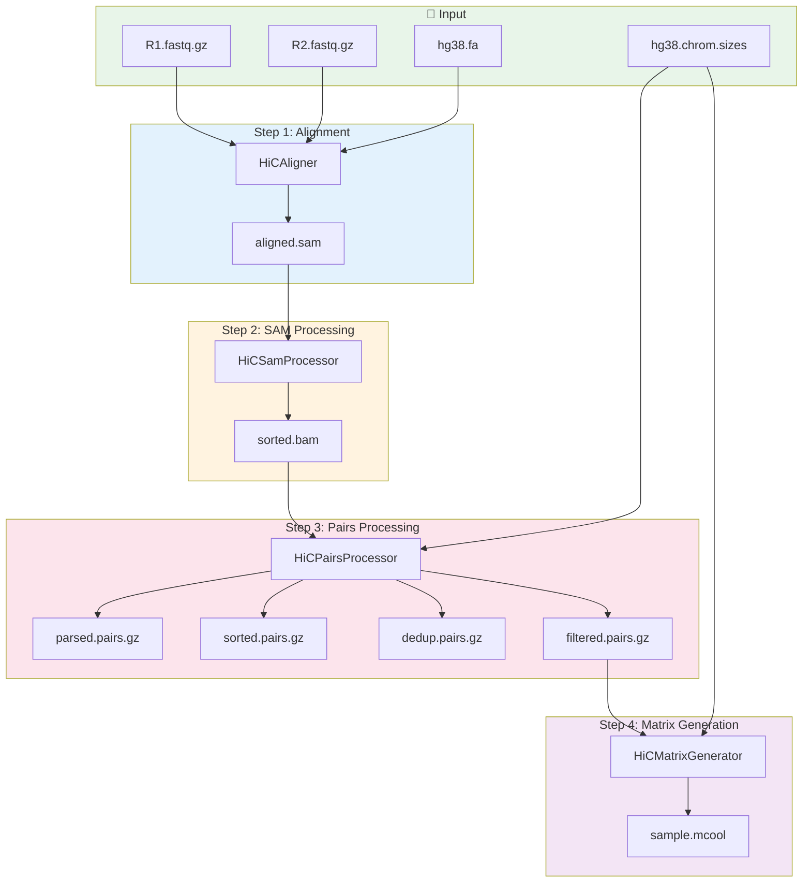

# Hi-C Analysis with Python API

This tutorial provides a comprehensive, step-by-step guide to analyzing Hi-C data using the Chr3D Python API. You'll learn exactly what each step does, which classes are used, and what output to expect.

## Pipeline Overview



## Source Code Locations

| Class | File Location | Purpose |
|-------|---------------|---------|
| `HiCPipeline` | `src/chr3d/bulk_hic.py:809` | Complete pipeline orchestrator |
| `HiCAligner` | `src/chr3d/bulk_hic.py:209` | BWA-MEM alignment |
| `HiCSamProcessor` | `src/chr3d/bulk_hic.py:315` | SAM to BAM conversion |
| `HiCPairsProcessor` | `src/chr3d/bulk_hic.py:402` | pairtools processing |
| `HiCMatrixGenerator` | `src/chr3d/bulk_hic.py:700` | cooler matrix generation |
| `FastqSplitter` | `src/chr3d/bulk_hic.py:67` | Split FASTQ for parallel processing |

## Output Directory Structure

After running the complete pipeline, your output directory will look like this:

```
output_dir/
├── aligned/
│   └── sample.sam                # Raw alignment (deleted if cleanup)
│
├── processed/
│   ├── sample.bam                # Unsorted BAM (deleted if cleanup)
│   └── sample_sorted.bam         # Name-sorted BAM
│
├── pairs/
│   ├── sample.temp.pairs.gz      # Parsed pairs (deleted if cleanup)
│   ├── sample.sorted.pairs.gz    # Position-sorted pairs
│   ├── sample.dedup.pairs.gz     # Deduplicated pairs
│   └── sample.filtered.pairs.gz  # Final filtered pairs
│
├── matrices/
│   └── sample.mcool              # Multi-resolution contact matrix
│
├── qc/
│   ├── sample_alignment.stats    # BWA alignment statistics
│   ├── sample_bam.stats          # BAM statistics
│   ├── sample_pairs.stats        # Pairs parsing statistics
│   ├── sample_dedup.stats        # Deduplication statistics
│   └── sample_summary.txt        # Overall QC summary
│
└── pipeline.log                  # Complete pipeline log
```

---

## Method 1: Using HiCPipeline (Recommended)

The `HiCPipeline` class provides a simple interface to run the complete pipeline.

### Code

```python
import sys
sys.path.insert(0, '/path/to/Chr3D/src')

from chr3d.bulk_hic import HiCPipeline

# Initialize pipeline
pipeline = HiCPipeline(
    genome_index='/ref/hg38.fa',
    chrom_sizes='/ref/hg38.chrom.sizes',
    threads=16,
    assembly='hg38',
    min_mapq=30,
    min_distance=1000,
    resolutions=[1000, 5000, 10000, 25000, 50000, 100000]
)

# Run complete pipeline
stats = pipeline.run(
    fastq1='/data/HiC_R1.fastq.gz',
    fastq2='/data/HiC_R2.fastq.gz',
    output_dir='/output/hic_analysis',
    sample_id='GM12878_HiC',
    cleanup=True  # Remove intermediate files
)

# Print results
print(f"Total pairs: {stats.get('total_pairs', 'N/A'):,}")
print(f"Unique pairs: {stats.get('unique_pairs', 'N/A'):,}")
print(f"Cis pairs: {stats.get('cis_pairs', 'N/A'):,}")
print(f"Output: {stats.get('output_mcool', 'N/A')}")
```

---

## Method 2: Step-by-Step with Individual Classes

For more control, use the individual step classes directly.

### Prerequisites

```python
import sys
import os
import logging
from pathlib import Path

sys.path.insert(0, '/path/to/Chr3D/src')

from chr3d.bulk_hic import (
    HiCAligner,
    HiCSamProcessor,
    HiCPairsProcessor,
    HiCMatrixGenerator
)

# Setup logging
logging.basicConfig(
    level=logging.INFO,
    format='%(asctime)s - %(name)s - %(levelname)s - %(message)s'
)

# Configuration
fastq_r1 = '/data/HiC_R1.fastq.gz'
fastq_r2 = '/data/HiC_R2.fastq.gz'
genome_index = '/ref/hg38.fa'
chrom_sizes = '/ref/hg38.chrom.sizes'
output_dir = Path('/output/hic_analysis')
sample_id = 'GM12878_HiC'
threads = 16

# Create output directories
for subdir in ['aligned', 'processed', 'pairs', 'matrices', 'qc']:
    (output_dir / subdir).mkdir(parents=True, exist_ok=True)
```

---

## Step 1: BWA-MEM Alignment

### What This Step Does

The `HiCAligner` class aligns paired-end Hi-C reads using BWA-MEM with Hi-C specific parameters (`-SP5M`).

### ASCII Diagram: Alignment Process

```
┌─────────────────────────────────────────────────────────────────┐
│                    STEP 1: BWA-MEM ALIGNMENT                     │
├─────────────────────────────────────────────────────────────────┤
│                                                                  │
│  Hi-C reads contain chimeric sequences:                          │
│  ┌─────────────────────────────────────────────────────────┐    │
│  │                                                          │    │
│  │  Read: [───Locus A───][───Locus B───]                   │    │
│  │                 ↑                                        │    │
│  │           Ligation junction                              │    │
│  │                                                          │    │
│  └─────────────────────────────────────────────────────────┘    │
│                                                                  │
│  BWA-MEM with Hi-C parameters:                                   │
│  ┌─────────────────────────────────────────────────────────┐    │
│  │                                                          │    │
│  │  -S : Skip mate rescue                                   │    │
│  │  -P : Skip pairing                                       │    │
│  │  -5 : Take alignment with smallest coordinate as primary │    │
│  │  -M : Mark shorter split hits as secondary               │    │
│  │                                                          │    │
│  │  These flags handle chimeric Hi-C reads properly         │    │
│  │                                                          │    │
│  └─────────────────────────────────────────────────────────┘    │
│                                                                  │
│  R1.fastq.gz ─┐                                                 │
│               ├──► bwa mem -SP5M ──► aligned.sam                │
│  R2.fastq.gz ─┘                                                 │
│                                                                  │
└─────────────────────────────────────────────────────────────────┘
```

### Code

```python
# =============================================================================
# STEP 1: BWA-MEM ALIGNMENT
# =============================================================================
print("=" * 70)
print("STEP 1: BWA-MEM ALIGNMENT")
print("=" * 70)

# Initialize aligner
aligner = HiCAligner(
    genome_index=genome_index,
    threads=threads
)

# Run alignment
align_stats = aligner.align(
    fastq1=fastq_r1,
    fastq2=fastq_r2,
    output_sam=str(output_dir / 'aligned' / f'{sample_id}.sam'),
    stats_file=str(output_dir / 'qc' / f'{sample_id}_alignment.stats')
)

print(f"Output SAM: {align_stats['output_sam']}")
print(f"SAM size: {align_stats['sam_size_bytes'] / 1e9:.2f} GB")

sam_file = align_stats['output_sam']
```

---

## Step 2: SAM/BAM Processing

### What This Step Does

The `HiCSamProcessor` converts SAM to BAM and sorts by read name (required for pairtools).

### ASCII Diagram: SAM Processing

```
┌─────────────────────────────────────────────────────────────────┐
│                    STEP 2: SAM/BAM PROCESSING                    │
├─────────────────────────────────────────────────────────────────┤
│                                                                  │
│  aligned.sam                                                     │
│       │                                                          │
│       ▼                                                          │
│  samtools view -bS                                               │
│       │                                                          │
│       ▼                                                          │
│  unsorted.bam                                                    │
│       │                                                          │
│       ▼                                                          │
│  samtools sort -n (sort by read NAME)                            │
│       │                                                          │
│       ▼                                                          │
│  sorted.bam                                                      │
│                                                                  │
│  Why sort by name?                                               │
│  ┌─────────────────────────────────────────────────────────┐    │
│  │  pairtools requires read pairs to be adjacent            │    │
│  │  Sorting by name groups R1 and R2 together               │    │
│  └─────────────────────────────────────────────────────────┘    │
│                                                                  │
└─────────────────────────────────────────────────────────────────┘
```

### Code

```python
# =============================================================================
# STEP 2: SAM/BAM PROCESSING
# =============================================================================
print("=" * 70)
print("STEP 2: SAM/BAM PROCESSING")
print("=" * 70)

# Initialize processor
sam_processor = HiCSamProcessor(threads=threads)

# Process SAM to sorted BAM
bam_stats = sam_processor.process(
    input_sam=sam_file,
    output_bam=str(output_dir / 'processed' / f'{sample_id}_sorted.bam'),
    stats_file=str(output_dir / 'qc' / f'{sample_id}_bam.stats'),
    keep_unsorted=False
)

print(f"Output BAM: {bam_stats['output_bam']}")
print(f"BAM size: {bam_stats['bam_size_bytes'] / 1e9:.2f} GB")

sorted_bam = bam_stats['output_bam']
```

---

## Step 3: Pairs Processing

### What This Step Does

The `HiCPairsProcessor` uses pairtools to:
1. **Parse**: Convert BAM to pairs format
2. **Sort**: Sort pairs by genomic position
3. **Dedup**: Remove PCR duplicates
4. **Filter**: Keep valid cis pairs above minimum distance

### ASCII Diagram: Pairs Processing Pipeline

```
┌─────────────────────────────────────────────────────────────────┐
│                    STEP 3: PAIRS PROCESSING                      │
├─────────────────────────────────────────────────────────────────┤
│                                                                  │
│  3.1 PARSE: BAM to Pairs                                         │
│  ┌─────────────────────────────────────────────────────────┐    │
│  │  sorted.bam                                              │    │
│  │       │                                                  │    │
│  │       ▼                                                  │    │
│  │  pairtools parse                                         │    │
│  │       │                                                  │    │
│  │       ▼                                                  │    │
│  │  Classify pair types:                                    │    │
│  │  • UU: Both uniquely mapped ✓                           │    │
│  │  • UR/RU: One unique, one rescued                        │    │
│  │  • MU/UM: One multi-mapped                               │    │
│  │  • MM: Both multi-mapped                                 │    │
│  │  • NN: Both unmapped                                     │    │
│  │       │                                                  │    │
│  │       ▼                                                  │    │
│  │  parsed.pairs.gz                                         │    │
│  └─────────────────────────────────────────────────────────┘    │
│                                                                  │
│  3.2 SORT: Position-based sorting                                │
│  ┌─────────────────────────────────────────────────────────┐    │
│  │  parsed.pairs.gz                                         │    │
│  │       │                                                  │    │
│  │       ▼                                                  │    │
│  │  pairtools sort                                          │    │
│  │       │                                                  │    │
│  │       ▼                                                  │    │
│  │  sorted.pairs.gz                                         │    │
│  └─────────────────────────────────────────────────────────┘    │
│                                                                  │
│  3.3 DEDUP: Remove PCR duplicates                                │
│  ┌─────────────────────────────────────────────────────────┐    │
│  │  sorted.pairs.gz                                         │    │
│  │       │                                                  │    │
│  │       ▼                                                  │    │
│  │  pairtools dedup                                         │    │
│  │  (max-mismatch = 3bp)                                    │    │
│  │       │                                                  │    │
│  │       ▼                                                  │    │
│  │  dedup.pairs.gz                                          │    │
│  └─────────────────────────────────────────────────────────┘    │
│                                                                  │
│  3.4 FILTER: Select valid pairs                                  │
│  ┌─────────────────────────────────────────────────────────┐    │
│  │  dedup.pairs.gz                                          │    │
│  │       │                                                  │    │
│  │       ▼                                                  │    │
│  │  pairtools select:                                       │    │
│  │  • pair_type == "UU"                                     │    │
│  │  • chrom1 == chrom2 (cis)                                │    │
│  │  • distance &gt;= 1000bp                                    │    │
│  │       │                                                  │    │
│  │       ▼                                                  │    │
│  │  filtered.pairs.gz                                       │    │
│  └─────────────────────────────────────────────────────────┘    │
│                                                                  │
└─────────────────────────────────────────────────────────────────┘
```

### Code

```python
# =============================================================================
# STEP 3: PAIRS PROCESSING
# =============================================================================
print("=" * 70)
print("STEP 3: PAIRS PROCESSING")
print("=" * 70)

# Initialize pairs processor
pairs_processor = HiCPairsProcessor(
    chrom_sizes=chrom_sizes,
    assembly='hg38',
    threads=threads
)

# Run all pairtools steps
pairs_stats = pairs_processor.process_all(
    input_bam=sorted_bam,
    output_prefix=str(output_dir / 'pairs' / sample_id),
    min_mapq=30,
    min_distance=1000
)

print(f"Total pairs: {pairs_stats.get('total_pairs', 'N/A'):,}")
print(f"Unique pairs: {pairs_stats.get('unique_pairs', 'N/A'):,}")
print(f"Cis pairs: {pairs_stats.get('cis_pairs', 'N/A'):,}")
print(f"Duplicate rate: {pairs_stats.get('duplicate_rate', 0)*100:.1f}%")

filtered_pairs = pairs_stats['filtered_pairs']
```

### Pairs File Format

```
## pairs format v1.0
#columns: readID chr1 pos1 chr2 pos2 strand1 strand2 pair_type
read001    chr1    1000000    chr1    1500000    +    -    UU
read002    chr1    2000000    chr1    2100000    +    +    UU
read003    chr1    3000000    chr2    4000000    -    +    UU
```

---

## Step 4: Contact Matrix Generation

### What This Step Does

The `HiCMatrixGenerator` uses cooler to create multi-resolution contact matrices (.mcool format).

### ASCII Diagram: Matrix Generation

```
┌─────────────────────────────────────────────────────────────────┐
│                    STEP 4: MATRIX GENERATION                     │
├─────────────────────────────────────────────────────────────────┤
│                                                                  │
│  filtered.pairs.gz                                               │
│       │                                                          │
│       ▼                                                          │
│  cooler cload pairs                                              │
│       │                                                          │
│       ▼                                                          │
│  Create contact matrix at base resolution (1kb)                  │
│       │                                                          │
│       ▼                                                          │
│  cooler zoomify                                                  │
│       │                                                          │
│       ▼                                                          │
│  Generate multiple resolutions:                                  │
│  ┌─────────────────────────────────────────────────────────┐    │
│  │  1kb   - Fine-scale loops (high memory)                  │    │
│  │  5kb   - Loop detection                                  │    │
│  │  10kb  - TAD calling                                     │    │
│  │  25kb  - Compartment analysis                            │    │
│  │  50kb  - Overview                                        │    │
│  │  100kb - Whole-genome view                               │    │
│  └─────────────────────────────────────────────────────────┘    │
│       │                                                          │
│       ▼                                                          │
│  sample.mcool (multi-resolution cooler)                          │
│                                                                  │
│  Matrix Structure:                                               │
│  ┌─────────────────────────────────────────────────────────┐    │
│  │                                                          │    │
│  │     chr1  chr2  chr3  ...                                │    │
│  │  chr1  ■■■   ■     ■                                     │    │
│  │  chr2   ■   ■■■    ■                                     │    │
│  │  chr3   ■    ■    ■■■                                    │    │
│  │  ...                                                     │    │
│  │                                                          │    │
│  │  ■ = contact frequency                                   │    │
│  │  Diagonal = cis contacts (same chromosome)               │    │
│  │  Off-diagonal = trans contacts (different chromosomes)   │    │
│  │                                                          │    │
│  └─────────────────────────────────────────────────────────┘    │
│                                                                  │
└─────────────────────────────────────────────────────────────────┘
```

### Code

```python
# =============================================================================
# STEP 4: CONTACT MATRIX GENERATION
# =============================================================================
print("=" * 70)
print("STEP 4: CONTACT MATRIX GENERATION")
print("=" * 70)

# Initialize matrix generator
matrix_generator = HiCMatrixGenerator(
    chrom_sizes=chrom_sizes,
    assembly='hg38'
)

# Generate multi-resolution matrix
matrix_stats = matrix_generator.generate(
    input_pairs=filtered_pairs,
    output_mcool=str(output_dir / 'matrices' / f'{sample_id}.mcool'),
    resolutions=[1000, 5000, 10000, 25000, 50000, 100000]
)

print(f"Output: {matrix_stats['output_mcool']}")
print(f"Size: {matrix_stats['mcool_size_bytes'] / 1e6:.2f} MB")
print(f"Resolutions: {matrix_stats['resolutions']}")
```

---

## Working with Output Files

### Loading .mcool Files

```python
import cooler

# Load specific resolution
clr = cooler.Cooler("sample.mcool::resolutions/10000")

# Get matrix for a region
matrix = clr.matrix(balance=False).fetch("chr1:50000000-60000000")

# Get balanced (normalized) matrix
matrix_balanced = clr.matrix(balance=True).fetch("chr1:50000000-60000000")

# Get chromosome info
print(clr.chromsizes)

# Get bins
bins = clr.bins()[:]
```

### Normalization

```python
import cooler

# Load cooler
clr = cooler.Cooler("sample.mcool::resolutions/10000")

# ICE normalization (iterative correction)
cooler.balance_cooler(clr, store=True)

# Access balanced weights
weights = clr.bins()['weight'][:]
```

### Visualization

```python
import matplotlib.pyplot as plt
import cooler
import numpy as np

# Load matrix
clr = cooler.Cooler("sample.mcool::resolutions/10000")
matrix = clr.matrix(balance=True).fetch("chr1:50000000-60000000")

# Plot
fig, ax = plt.subplots(figsize=(10, 10))
im = ax.imshow(
    np.log10(matrix + 1),
    cmap='YlOrRd',
    vmin=0,
    vmax=3
)
plt.colorbar(im, label='log10(contacts + 1)')
ax.set_title('Hi-C Contact Matrix (chr1:50-60Mb)')
plt.savefig('hic_matrix.png', dpi=150)
```

---

## Downstream Analysis

### TAD Calling with cooltools

```python
import cooltools
import cooler

clr = cooler.Cooler("sample.mcool::resolutions/10000")

# Calculate insulation score
insulation = cooltools.insulation(
    clr,
    window_bp=[100000, 200000, 500000]
)

# Find TAD boundaries
boundaries = insulation[insulation['is_boundary_100000'] == True]
print(f"Found {len(boundaries)} TAD boundaries")
```

### Compartment Analysis

```python
import cooltools

clr = cooler.Cooler("sample.mcool::resolutions/100000")

# Calculate eigenvectors
eigs = cooltools.eigs_cis(clr, n_eigs=3)

# First eigenvector = A/B compartments
compartments = eigs[0]
```

### Loop Calling (External Tools)

Hi-C loop calling requires external tools like HiCCUPS or Mustache:

```bash
# Using Juicer HiCCUPS
java -jar juicer_tools.jar hiccups sample.hic loops_output

# Using Mustache
mustache -f sample.mcool -r 10000 -o loops.tsv
```

---

## QC Statistics

### Understanding QC Output

The pipeline generates QC statistics in `qc/sample_pairs.stats`:

| Metric | Description | Good Value |
|--------|-------------|------------|
| total | Total read pairs | - |
| total_mapped | Mapped pairs | &gt;90% |
| total_dups | Duplicate pairs | &lt;20% |
| cis | Same-chromosome pairs | &gt;60% |
| trans | Different-chromosome pairs | &lt;40% |
| cis_1kb+ | Cis pairs &gt;1kb apart | &gt;40% |
| cis_10kb+ | Cis pairs &gt;10kb apart | &gt;30% |

### Quality Assessment

```python
def assess_quality(stats_file):
    """Assess Hi-C data quality from pairtools stats."""
    stats = {}
    with open(stats_file) as f:
        for line in f:
            if line.startswith('#'):
                continue
            parts = line.strip().split('\t')
            if len(parts) == 2:
                stats[parts[0]] = int(parts[1])
    
    total = stats.get('total', 1)
    cis = stats.get('cis', 0)
    trans = stats.get('trans', 0)
    dups = stats.get('total_dups', 0)
    
    cis_ratio = cis / (cis + trans) if (cis + trans) > 0 else 0
    dup_rate = dups / total if total > 0 else 0
    
    print(f"Cis ratio: {cis_ratio*100:.1f}%", "✓" if cis_ratio > 0.6 else "⚠")
    print(f"Duplicate rate: {dup_rate*100:.1f}%", "✓" if dup_rate < 0.2 else "⚠")
```

---

## Complete Pipeline Script

```python
#!/usr/bin/env python3
"""
Complete Hi-C Analysis Pipeline using Chr3D Python API
"""

import sys
sys.path.insert(0, '/path/to/Chr3D/src')

from chr3d.bulk_hic import HiCPipeline

def main():
    # Initialize pipeline
    pipeline = HiCPipeline(
        genome_index='/ref/hg38.fa',
        chrom_sizes='/ref/hg38.chrom.sizes',
        threads=16,
        assembly='hg38',
        min_mapq=30,
        min_distance=1000,
        resolutions=[1000, 5000, 10000, 25000, 50000, 100000]
    )
    
    # Run pipeline
    stats = pipeline.run(
        fastq1='/data/HiC_R1.fastq.gz',
        fastq2='/data/HiC_R2.fastq.gz',
        output_dir='/output/hic_analysis',
        sample_id='GM12878_HiC',
        cleanup=True
    )
    
    # Print summary
    print("\n" + "=" * 70)
    print("PIPELINE COMPLETE")
    print("=" * 70)
    print(f"Output: {stats.get('output_mcool', 'N/A')}")
    print(f"Total pairs: {stats.get('total_pairs', 'N/A'):,}")
    print(f"Cis ratio: {stats.get('cis_ratio', 0)*100:.1f}%")

if __name__ == '__main__':
    main()
```

---

## Key Differences: Hi-C vs HiChIP

| Feature | Hi-C | HiChIP |
|---------|------|--------|
| Enrichment | None (all contacts) | ChIP (protein-specific) |
| Output | Contact matrix (.mcool) | Loops + peaks |
| Loop calling | External tools | Built-in |
| Peak calling | No | Yes |
| Resolution | Genome-wide | Focused on binding sites |

---

## See Also

- [Hi-C CLI Tutorial](./hic-cli) - Command-line interface version
- [Hi-C API Reference](../api/hic) - Detailed API documentation
- [HiChIP API Tutorial](./hichip-api) - HiChIP analysis tutorial
