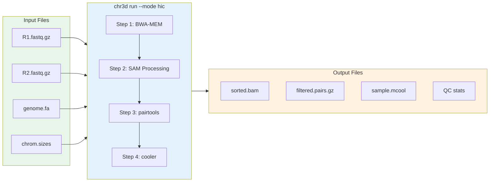

# Hi-C Analysis with CLI

This tutorial provides a comprehensive guide to analyzing Hi-C data using the Chr3D command-line interface.

## Pipeline Overview



## Quick Start

```bash
# Run complete Hi-C pipeline
chr3d run --mode hic \
    --fastq-r1 sample_R1.fastq.gz \
    --fastq-r2 sample_R2.fastq.gz \
    --genome-index /ref/hg38.fa \
    --chrom-sizes /ref/hg38.chrom.sizes \
    --output-dir ./hic_output \
    --threads 16 \
    --sample-id my_sample
```

## Prerequisites

### 1. Index Reference Genome

```bash
# Create BWA index
bwa index /ref/hg38.fa
```

### 2. Create Chromosome Sizes File

```bash
# Using samtools
samtools faidx /ref/hg38.fa
cut -f1,2 /ref/hg38.fa.fai > /ref/hg38.chrom.sizes

# Or download from UCSC
wget https://hgdownload.soe.ucsc.edu/goldenPath/hg38/bigZips/hg38.chrom.sizes
```

### 3. Install Dependencies

```bash
# Required tools
conda install -c bioconda bwa samtools pairtools cooler
```

## Complete Command Reference

```bash
chr3d run --mode hic \
    --fastq-r1 <R1.fastq.gz> \
    --fastq-r2 <R2.fastq.gz> \
    --genome-index <genome.fa> \
    --chrom-sizes <chrom.sizes> \
    --output-dir <output_directory> \
    [OPTIONS]
```

### Required Arguments

| Argument | Description |
|----------|-------------|
| `--fastq-r1` | Input R1 FASTQ file (gzipped supported) |
| `--fastq-r2` | Input R2 FASTQ file (gzipped supported) |
| `--genome-index` | BWA-indexed reference genome FASTA |
| `--chrom-sizes` | Chromosome sizes file |
| `--output-dir` | Output directory |

### Optional Arguments

| Argument | Default | Description |
|----------|---------|-------------|
| `--threads` | 24 | Number of threads |
| `--sample-id` | sample | Sample identifier |
| `--assembly` | hg38 | Genome assembly name |
| `--mapping-quality` | 30 | Minimum mapping quality |
| `--min-distance` | 1000 | Minimum pair distance (bp) |
| `--resolution` | 1000,5000,10000 | Matrix resolutions (comma-separated) |
| `--keep-intermediates` | False | Keep intermediate files |

## Step-by-Step Execution

### Full Example with All Options

```bash
chr3d run --mode hic \
    --fastq-r1 /data/GM12878_HiC_R1.fastq.gz \
    --fastq-r2 /data/GM12878_HiC_R2.fastq.gz \
    --genome-index /ref/hg38.fa \
    --chrom-sizes /ref/hg38.chrom.sizes \
    --output-dir /output/hic_analysis \
    --threads 24 \
    --sample-id GM12878_HiC \
    --assembly hg38 \
    --mapping-quality 30 \
    --min-distance 1000 \
    --resolution 1000,5000,10000,25000,50000,100000 \
    --keep-intermediates
```

## Output Directory Structure

After running the pipeline, your output directory will contain:

```
output_dir/
├── aligned/
│   └── sample.sam              # Raw alignment (if --keep-intermediates)
│
├── processed/
│   └── sample_sorted.bam       # Name-sorted BAM
│
├── pairs/
│   ├── sample.temp.pairs.gz    # Parsed pairs (if --keep-intermediates)
│   ├── sample.sorted.pairs.gz  # Position-sorted pairs
│   ├── sample.dedup.pairs.gz   # Deduplicated pairs
│   └── sample.filtered.pairs.gz # Final filtered pairs
│
├── matrices/
│   └── sample.mcool            # Multi-resolution contact matrix
│
├── qc/
│   ├── sample_alignment.stats  # BWA alignment statistics
│   ├── sample_bam.stats        # BAM statistics
│   ├── sample_pairs.stats      # Pairs parsing statistics
│   ├── sample_dedup.stats      # Deduplication statistics
│   └── sample_summary.txt      # Overall QC summary
│
└── pipeline.log                # Complete pipeline log
```

## Pipeline Steps Explained

### Step 1: BWA-MEM Alignment

Aligns paired-end reads using BWA-MEM with Hi-C specific parameters.

```
┌─────────────────────────────────────────────────────────────────┐
│  STEP 1: BWA-MEM ALIGNMENT                                       │
├─────────────────────────────────────────────────────────────────┤
│                                                                  │
│  Command: bwa mem -SP5M -t {threads} {genome} {R1} {R2}         │
│                                                                  │
│  Hi-C specific flags:                                            │
│  -S : Skip mate rescue                                           │
│  -P : Skip pairing                                               │
│  -5 : Take alignment with smallest coordinate as primary         │
│  -M : Mark shorter split hits as secondary                       │
│                                                                  │
│  These flags handle chimeric Hi-C reads properly                 │
│                                                                  │
└─────────────────────────────────────────────────────────────────┘
```

### Step 2: SAM/BAM Processing

Converts SAM to BAM and sorts by read name.

```
┌─────────────────────────────────────────────────────────────────┐
│  STEP 2: SAM/BAM PROCESSING                                      │
├─────────────────────────────────────────────────────────────────┤
│                                                                  │
│  aligned.sam                                                     │
│       │                                                          │
│       ▼                                                          │
│  samtools view -bS  (convert to BAM)                             │
│       │                                                          │
│       ▼                                                          │
│  samtools sort -n   (sort by read NAME)                          │
│       │                                                          │
│       ▼                                                          │
│  sorted.bam                                                      │
│                                                                  │
│  Why sort by name?                                               │
│  pairtools requires read pairs to be adjacent in the file        │
│                                                                  │
└─────────────────────────────────────────────────────────────────┘
```

### Step 3: Pairs Processing (pairtools)

Processes Hi-C pairs through multiple pairtools steps.

```
┌─────────────────────────────────────────────────────────────────┐
│  STEP 3: PAIRS PROCESSING                                        │
├─────────────────────────────────────────────────────────────────┤
│                                                                  │
│  3.1 pairtools parse                                             │
│  ┌─────────────────────────────────────────────────────────┐    │
│  │  Convert BAM to pairs format                             │    │
│  │  Classify pair types: UU, UR, MU, MM, NN                 │    │
│  └─────────────────────────────────────────────────────────┘    │
│                                                                  │
│  3.2 pairtools sort                                              │
│  ┌─────────────────────────────────────────────────────────┐    │
│  │  Sort pairs by genomic position                          │    │
│  │  Required for deduplication                              │    │
│  └─────────────────────────────────────────────────────────┘    │
│                                                                  │
│  3.3 pairtools dedup                                             │
│  ┌─────────────────────────────────────────────────────────┐    │
│  │  Remove PCR duplicates                                   │    │
│  │  Max mismatch: 3bp                                       │    │
│  └─────────────────────────────────────────────────────────┘    │
│                                                                  │
│  3.4 pairtools select                                            │
│  ┌─────────────────────────────────────────────────────────┐    │
│  │  Filter criteria:                                        │    │
│  │  • pair_type == "UU" (both uniquely mapped)              │    │
│  │  • chrom1 == chrom2 (cis pairs only)                     │    │
│  │  • distance &gt;= min_distance (default: 1000bp)           │    │
│  └─────────────────────────────────────────────────────────┘    │
│                                                                  │
└─────────────────────────────────────────────────────────────────┘
```

### Step 4: Contact Matrix Generation (cooler)

Creates multi-resolution contact matrices.

```
┌─────────────────────────────────────────────────────────────────┐
│  STEP 4: MATRIX GENERATION                                       │
├─────────────────────────────────────────────────────────────────┤
│                                                                  │
│  filtered.pairs.gz                                               │
│       │                                                          │
│       ▼                                                          │
│  cooler cload pairs                                              │
│       │                                                          │
│       ▼                                                          │
│  Create base resolution matrix                                   │
│       │                                                          │
│       ▼                                                          │
│  cooler zoomify                                                  │
│       │                                                          │
│       ▼                                                          │
│  sample.mcool (multi-resolution)                                 │
│                                                                  │
│  Resolutions:                                                    │
│  ┌─────────────────────────────────────────────────────────┐    │
│  │  1kb   - Fine-scale analysis (high memory)               │    │
│  │  5kb   - Loop detection                                  │    │
│  │  10kb  - TAD calling                                     │    │
│  │  25kb  - Compartment analysis                            │    │
│  │  50kb  - Overview                                        │    │
│  │  100kb - Whole-genome visualization                      │    │
│  └─────────────────────────────────────────────────────────┘    │
│                                                                  │
└─────────────────────────────────────────────────────────────────┘
```

## Example Log Output

```
======================================================================
Chr3D Hi-C Pipeline
======================================================================
Sample ID: GM12878_HiC
Mode: hic
Threads: 24

======================================================================
STEP 1: BWA-MEM ALIGNMENT
======================================================================
Running BWA MEM alignment...
  Total read pairs: 500,000,000
  Output SAM: 125.3 GB

======================================================================
STEP 2: SAM/BAM PROCESSING
======================================================================
Converting SAM to BAM...
Sorting BAM by read name...
  Output BAM: 45.2 GB

======================================================================
STEP 3: PAIRS PROCESSING
======================================================================
Parsing BAM to pairs format...
  Total pairs: 500,000,000
  UU pairs: 425,000,000 (85.0%)
Sorting pairs...
Removing duplicates...
  Unique pairs: 380,000,000
  Duplicate rate: 10.6%
Filtering pairs...
  Cis pairs (&gt;1kb): 285,000,000 (75.0%)

======================================================================
STEP 4: MATRIX GENERATION
======================================================================
Creating contact matrix...
  Resolutions: 1000, 5000, 10000, 25000, 50000, 100000
  Output: sample.mcool (15.2 GB)

======================================================================
PIPELINE COMPLETE
======================================================================
Output directory: /output/hic_analysis
Contact matrix: /output/hic_analysis/matrices/sample.mcool
```

## Output File Formats

### Pairs File Format (.pairs.gz)

Standard 4DN pairs format:

```
## pairs format v1.0
#columns: readID chr1 pos1 chr2 pos2 strand1 strand2 pair_type
read001    chr1    1000000    chr1    1500000    +    -    UU
read002    chr1    2000000    chr1    2100000    +    +    UU
```

### Cooler Format (.mcool)

Multi-resolution HDF5-based contact matrix format.

**Accessing with Python:**
```python
import cooler

# Load specific resolution
clr = cooler.Cooler("sample.mcool::resolutions/10000")

# Get matrix
matrix = clr.matrix(balance=True).fetch("chr1:50000000-60000000")
```

**Accessing with CLI:**
```bash
# List resolutions
cooler ls sample.mcool

# Dump matrix region
cooler dump -r chr1:50000000-60000000 sample.mcool::resolutions/10000
```

## QC Statistics

### Understanding QC Output

The `qc/sample_pairs.stats` file contains:

| Metric | Description | Good Value |
|--------|-------------|------------|
| total | Total read pairs | - |
| total_mapped | Mapped pairs | &gt;90% |
| total_dups | Duplicate pairs | &lt;20% |
| cis | Same-chromosome pairs | &gt;60% |
| trans | Different-chromosome pairs | &lt;40% |
| cis_1kb+ | Cis pairs &gt;1kb apart | &gt;40% |
| cis_10kb+ | Cis pairs &gt;10kb apart | &gt;30% |

### Quality Assessment

**Good Hi-C Data:**
- Mapping rate: &gt;90%
- Cis ratio: &gt;60%
- Cis &gt;10kb: &gt;30%
- Duplicate rate: &lt;20%

**Warning Signs:**
- High trans ratio (&gt;40%): May indicate random ligation
- Low cis &gt;10kb (&lt;20%): Short-range bias
- High duplicate rate (&gt;40%): Low library complexity

## Resolution Guidelines

| Resolution | Use Case | Memory Required |
|------------|----------|-----------------|
| 1kb | Fine-scale loops | Very High (&gt;64GB) |
| 5kb | Loop detection | High (&gt;32GB) |
| 10kb | TAD calling | Medium (&gt;16GB) |
| 25kb | Compartments | Low (&gt;8GB) |
| 50kb | Overview | Low |
| 100kb | Whole-genome view | Very Low |

**Recommendations:**
- Loop calling: 5-10kb resolution
- TAD calling: 10-25kb resolution
- Compartment analysis: 25-100kb resolution
- Visualization: Multiple resolutions

## Downstream Analysis

### TAD Calling

```bash
# Using cooltools
cooltools insulation sample.mcool::resolutions/10000 \
    --window-pixels 10 \
    -o sample_insulation.tsv

# Using HiCExplorer
hicFindTADs -m sample.h5 \
    --outPrefix sample_tads \
    --correctForMultipleTesting fdr
```

### Compartment Analysis

```bash
# Using cooltools
cooltools eigs-cis sample.mcool::resolutions/100000 \
    --phasing-track gc_content.bw \
    -o sample_compartments
```

### Loop Calling

```bash
# Using Juicer HiCCUPS (requires .hic format)
java -jar juicer_tools.jar hiccups sample.hic loops_output

# Using Mustache
mustache -f sample.mcool -r 10000 -o loops.tsv
```

### Matrix Normalization

```bash
# ICE normalization with cooler
cooler balance sample.mcool::resolutions/10000

# KR normalization with Juicer
java -jar juicer_tools.jar addNorm sample.hic
```

## Troubleshooting

### Low cis ratio

- Check for contamination in library
- Verify ligation efficiency
- May indicate protocol issues

### High duplicate rate

- Increase library complexity
- Sequence deeper
- Optimize PCR cycles

### Memory errors

- Reduce resolution: `--resolution 10000,25000,50000`
- Increase available RAM
- Process chromosomes separately

### Cooler errors

- Verify chromosome sizes file format
- Check pairs file integrity
- Ensure sufficient disk space

## Hi-C vs HiChIP Comparison

| Feature | Hi-C | HiChIP |
|---------|------|--------|
| Enrichment | None | ChIP (protein-specific) |
| Output | Contact matrix (.mcool) | Loops + peaks |
| Loop calling | External tools required | Built-in |
| Peak calling | No | Yes |
| Resolution | Genome-wide | Focused on binding sites |
| Typical depth | 500M-1B reads | 100M-200M reads |

## See Also

- [Hi-C API Tutorial](./hic-api) - Python API version
- [Hi-C CLI Reference](../cli/hic) - Complete CLI documentation
- [HiChIP CLI Tutorial](./hichip-cli) - HiChIP analysis tutorial
