import { Callout, Cards } from 'nextra/components'

# `chr3d` API Reference

**Chr3D** is a Python framework for 3D chromatin interaction analysis. The
package exposes a uniform top-level import — every pipeline, processing step,
and utility is accessible from a single namespace.

```python
import chr3d as c3d
```

<Callout type="info">
  This reference documents the **stable public API** of `chr3d` v3.2.0.
  All classes and functions listed here are importable from `chr3d` or one of
  its sub-packages (`chr3d.hic`, `chr3d.peak_based`, `chr3d.utils`).
</Callout>

## Package layout

```mermaid
graph TD
    A[chr3d] --> B[chr3d.hic]
    A --> C[chr3d.peak_based]
    A --> D[chr3d.utils]

    B --> B1[HiCPipeline]
    B --> B2[HiCAligner]
    B --> B3[HiCSamProcessor]
    B --> B4[HiCPairsProcessor]
    B --> B5[HiCMatrixGenerator]
    B --> B6[HiCQCAnalyzer]
    B --> B7[FastqSplitter]
    B --> B8[SnHiCPipeline]

    C --> C1[ChiaPetPipeline]
    C --> C2[HiChIPPipeline]
    C --> C3[PETMapperV3]
    C --> C4[LinkerFilterV3]
    C --> C5[PeakCaller]
    C --> C6[FragmentIndex]
    C --> C7[background_model]

    D --> D1[RestrictionSiteGenerator]
    D --> D2[restriction_site_generator]
    D --> D3[loops_to_beddb]
    D --> D4[detect_restriction_enzyme]

    style A fill:#111,color:#fff,stroke:#555
    style B fill:#1e293b,color:#fff
    style C fill:#1e293b,color:#fff
    style D fill:#1e293b,color:#fff
```



## Pipelines at a glance

| Pipeline | Module | Input | Output |
| --- | --- | --- | --- |
| **Bulk Hi-C** | [`HiCPipeline`](/API/bulk-hic/hic-pipeline) | paired FASTQ | `.cool`, `.mcool`, TADs, loops, compartments |
| **Single-nucleus Hi-C** | [`SnHiCPipeline`](/API/sn-hic/snhic-pipeline) | list of per-cell FASTQs | per-cell `.cool`, pseudobulk `.mcool` |
| **ChIA-PET** | [`ChiaPetPipeline`](/API/chiapet/chiapet-pipeline) | paired FASTQ + linkers | peaks + significant loops |
| **HiChIP** | [`HiChIPPipeline`](/API/hichip/hichip-pipeline) | paired FASTQ + fragment BED | peaks + significant loops |

## Low-level building blocks

Every pipeline is composed of **standalone, modular step-classes** that can be
used independently when you need finer control than the orchestrators provide:

| Category | Classes |
| --- | --- |
| **Alignment & SAM/BAM** | [`HiCAligner`](/API/bulk-hic/hic-aligner), [`HiCSamProcessor`](/API/bulk-hic/hic-sam-processor), [`PETMapperV3`](/API/peak-based/pet-mapper) |
| **Pairs / BEDPE** | [`HiCPairsProcessor`](/API/bulk-hic/hic-pairs-processor) |
| **Contact matrices** | [`HiCMatrixGenerator`](/API/bulk-hic/hic-matrix-generator) |
| **Linker filtering** | [`LinkerFilterV3`](/API/peak-based/linker-filter) |
| **Peak calling** | [`PeakCaller`](/API/peak-based/peak-caller) |
| **Fragment digest / purification** | [`RestrictionSiteGenerator`](/API/utils/restriction-site-generator), [`FragmentIndex`](/API/peak-based/fragment-index), [`purify_bedpe`](/API/peak-based/purify-bedpe) |
| **Loop calling (statistical)** | [`classify_pets`](/API/background-model/classify-pets), [`extract_templates`](/API/background-model/extract-templates), [`BackgroundSamplingPhase1`](/API/background-model/phase1), [`calculate_pvalues`](/API/background-model/phase2), [`apply_fdr_corrections`](/API/background-model/fdr) |
| **Quality control** | [`HiCQCAnalyzer`](/API/bulk-hic/hic-qc-analyzer) |
| **Data preparation** | [`FastqSplitter`](/API/bulk-hic/fastq-splitter) |
| **Visualisation export** | [`loops_to_beddb`](/API/utils/loops-to-beddb) |
| **QC / detection** | [`detect_restriction_enzyme`](/API/utils/detect-restriction-enzyme) |

## Conventions used in this reference

- Every class signature is shown in the form
  `class chr3d.X(param1, param2=default, ...)`.
- Every method signature is shown as `MethodName(param1, param2, ...) → ReturnType`.
- Parameters that accept `None` are marked *optional*.
- Default values shown match the source code exactly.
- All paths are strings; all thread/core counts are ints.

## Entry points

| Import pattern | Example |
| --- | --- |
| Top-level | `import chr3d as c3d; c3d.HiCPipeline(...)` |
| Sub-package | `from chr3d.hic import HiCPipeline` |
| Utils function | `from chr3d.utils import loops_to_beddb` |
| Background model | `from chr3d.peak_based.background_model import classify_pets` |

<Callout type="info">
  For a CLI-based interface, see `chr3d --help` (entry point registered in
  `pyproject.toml`).
</Callout>
